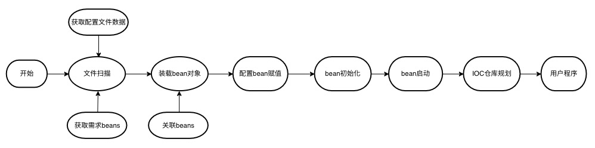

# 功能特性

## _使用须知注意事项：_

1. 被注入`bean`必须含有无参构造方法，即被`@Component`、`@Configuration`或者自定义注入注解标记的类必须含有无参构造方法。

## Quick Start

_详情请阅览_[DemoApplication.java](src%2Ftest%2Fjava%2Forg%2Ffhm%2Fioc%2FDemoApplication.java)

### 示例：

#### ***程序启动类***

```java

@ScanPackageConfig("scan.package.name")
public class DemoApplication {
    public static void main(String[] args) {
        Bootstrap.open(args, DemoStarter.class);
    }

}
```  

#### ***`IStarter`接口实现***

```java
@Component // Inject into the IOC
public class DemoStarter implements IStarter {

    @Setup // Load from the IOC 
    private DemoAttach attach;
    
    @Setup("Demo") 
    // Load from the IOC by interface or abstract-class.
    // Multiple implementations need to be annotated with values that 
    // correspond to the injection names of their respective implementation objects.
    private IDemoTest demo;

    @Setup("->test.demo.bean.name") 
    // Specifies that the reference of the test.demo.bean.name
    // attribute in the configuration
    // file is the name of the loading object
    private IDemoTest demoAttach;

    @Setup // Mapping loads bean mechanisms
    private Map<String, IDemoTest> iDemoTestMap;

    @Override
    public List<Class<? extends Annotation>> newManageMembers() {
        ArrayList<Class<? extends Annotation>> classes = new ArrayList<>();
        classes.add(DemoComponent.class);
        classes.add(DemoTestComponent.class);
        return classes; // Returns a collection of annotations for custom injection containers
    }

    @Override
    public void manageNotify(List<?> beans, Class<? extends Annotation> clazz) {
        if (DemoComponent.class.isAssignableFrom(clazz)) { // Determines whether the bean is marked by the DemoComponent annotation
            // Beans marked with DemoComponent annotations are treated independently
        }
    }

    @Override
    public void start(String[] args) throws Exception {
        demo.test(); // Runs test method of the Demo
        demoAttach.test(); // Runs test method of the DemoAttach
        iDemoTestMap.forEach((k, v) -> v.test());
    }

    @Override
    public void close() throws Exception {
        // Runs before the IOC ends
    }

}
```  

#### ***自定义注入注解***

```java
    @Component // Specify a custom annotation
    @Target(ElementType.TYPE)
    @Retention(RetentionPolicy.RUNTIME)
    public @interface DemoComponent {
    
        String value();
    
    }
```

#### ***自定义注入注解注入`IOC`***

```java

@DemoComponent("Demo")
public class Demo {

    private final ILoggerHandler logger = LoggerHandler.getLogger(Demo.class);

    public void test() {
        logger.info("demo test successful");
    }


    @BeanInitial
    private void beanInitial() throws Exception {
        // The bean to do initial
        logger.info("demo start initialize");
    }

    @BeanEnable
    private void beanEnable() throws Exception {
        // The bean to do enable
        logger.info("demo start enable");
    }

}
```

### 说明：

#### ***类***

|         类         |              说明              | 类型  |
|:-----------------:|:----------------------------:|:---:|
| `DemoApplication` |            程序启动类             | 普通类 |
|   `DemoStarter`   |        `IStarter`接口实现        | 普通类 |  
|  `DemoComponent`  | 自定义注入注解，**需要添加`@Component`** | 注解  |
|      `Demo`       |        自定义注入注解注入`IOC`        | 普通类 |

#### ***方法***

|                                  方法                                   |                  参数                  |   返回值   |  异常   |           说明            |
|:---------------------------------------------------------------------:|:------------------------------------:|:-------:|:-----:|:-----------------------:|
|               `Bootstrap.open(args, DemoStarter.class)`               |   1. 程序入口参数；2. 自定义接口`IStarter`实现类    |    无    |   无   |        `IOC`启动方法        |
|        `List<Class<? extends Annotation>> newManageMembers()`         |                  无                   | 自定义注解集合 |  处理   |     添加自定义注入`IOC`注解      |
| `void manageNotify(List<?> beans, Class<? extends Annotation> clazz)` | 1. 被自定义注入注解管理`bean`集合； 2. 自定义注入注解类对象 |    无    | 处理或抛出 | 对参数`beans`标记的对象集合做自定义处理 |
|             `void start(String[] args) throws Exception`              |              1. 程序入口参数               |    无    | 处理或抛出 |        开始执行用户程序         |
|                    `void close() throws Exception`                    |              `IOC`关闭回调               |    无    | 处理或抛出 |        `IOC`关闭回调        |
|                         `void beanInitial()`                          |                  无                   |    无    | 处理或抛出 |      [生命周期](#生命周期)      |
|                          `void beanEnable()`                          |                  无                   |    无    | 处理或抛出 |      [生命周期](#生命周期)      |

#### ***注解***

|                    注解                     |         描述          |       值说明       |
|:-----------------------------------------:|:-------------------:|:---------------:|
| `@ScanPackageConfig("scan.package.name")` | [扫描包匹配规则](#扫描包匹配规则) |      包扫描路径      |
|               `@Component`                |     `IOC`默认注入注解     |   `bean`注入名称    |
|                 `@Setup`                  | [`bean`装载](#bean装载) | 需要装载的`bean`注入名称 |
|              `@BeanInitial`               |    标记`bean`初始化方法    |        无        |
|               `@BeanEnable`               |    标记`bean`启动方法     |        无        |

#### **核心接口**

|        接口        |   描述   |                  说明                  |                    使用                    |
|:----------------:|:------:|:------------------------------------:|:----------------------------------------:|
| `ILoggerHandler` | 日记处理接口 | 封装日记打印方法，解构项目和日志框架，方便自定义日志功能或者更换日志框架 | 重写`ILoggerHandler`实现，[自定义日志框架](#自定义日志框架) |


### 关键点详解：

#### ***生命周期***



#### ***扫描包匹配规则***

1. 注解`@ScanPackageConfig`必须在程序入口方法对应的类上。
2. 注解`@ScanPackageConfig`的值必须至少包含被扫描包第一级目录。  
   如`scan.package.name`必须含有`scan`。
3. `**`表示任意级目录；`*`表示一级目录。  
   如匹配`scan.package.name.bean`、`scan.package.name.config`、`scan.package.name.xxx`，  
   值可以设置为`scan.**`、`scan.**.name.*`、`scan.package.name.*`、`scan.*.name.*`

#### ***`bean`装载***

1. 根据类装载：
```java
    @Setup 
    // 通过类装载
    // 注解值可以选择性赋值
    private DemoAttach attach;
```

2. 根据接口或者抽象类装载：
```java
    @Setup("Demo")
    // 通过接口或者抽象类装载
    // 多个实现需要赋值注解值为其某个实现对象的注入名称
    private IDemoTest demo;
```

3. 根据配置文件属性值装载：
```java
    @Setup("->test.demo.bean.name") 
    // 指定配置文件中test.demo.bean.name属性值为对象的注入名称
    private IDemoTest demoAttach;
```

4. 根据映射机制装载：
```java
    @Setup 
    // 注解值不填
    // map容器映射装载，key为接口或者抽象类实现的类名称，value为实现对象
    private Map<String, IDemoTest> iDemoTestMap;
```

#### ***自定义日志框架***


### 运行结果日记：

        ███████ ██   ██ ███    ███       ██  ██████   ██████
        ██      ██   ██ ████  ████       ██ ██    ██ ██
        █████   ███████ ██ ████ ██ █████ ██ ██    ██ ██
        ██      ██   ██ ██  ██  ██       ██ ██    ██ ██
        ██      ██   ██ ██      ██       ██  ██████   ██████
        ============================version 1.0.0 release===
11:16:14.856 [main] INFO org.fhm.ioc.manager.Bootstrap - read VM parameter  
11:16:14.864 [main] INFO org.fhm.ioc.manager.Bootstrap - start collect configuration file and class file  
11:16:14.869 [main] INFO org.fhm.ioc.manager.Bootstrap - start initialize resource scanner  
11:16:14.870 [main] INFO org.fhm.ioc.service.ResourceScanner - start configure resource scanner  
11:16:14.889 [main] INFO org.fhm.ioc.manager.Bootstrap - start filter out the required CP  
11:16:14.889 [main] INFO org.fhm.ioc.manager.Bootstrap - start fixed-point scanning  
11:16:14.890 [main] INFO org.fhm.ioc.manager.Bootstrap - start scan the path to obtain the required resources and class files  
11:16:15.025 [main] INFO org.fhm.ioc.manager.Bootstrap - start clear cache and create beans  
11:16:15.033 [main] INFO org.fhm.ioc.manager.Bootstrap - start auto setup bean  
11:16:15.033 [main] INFO org.fhm.ioc.manager.Bootstrap - initial auto setup container  
11:16:15.033 [main] INFO org.fhm.ioc.manager.Bootstrap - auto setup obj  
11:16:15.046 [main] INFO org.fhm.ioc.manager.Bootstrap - auto setup map obj  
11:16:15.052 [main] INFO org.fhm.ioc.manager.Bootstrap - distribute bean  
11:16:15.054 [main] INFO org.fhm.ioc.manager.Bootstrap - start initial configuration  
11:16:15.063 [main] INFO org.fhm.ioc.manager.Bootstrap - start optimize bean  
11:16:15.063 [main] INFO org.fhm.ioc.manager.Bootstrap - clear not necessary implement and cache  
11:16:15.070 [main] INFO org.fhm.ioc.manager.Bootstrap - start bean initial  
11:16:15.073 [main] INFO org.fhm.ioc.bean.Demo - `demo start initialize` // bean初始化调用  
11:16:15.073 [main] INFO org.fhm.ioc.bean.Demo - `desc: hello,reality, lucky number: 66` // bean初始化调用获取配置文件信息  
11:16:15.076 [main] INFO org.fhm.ioc.manager.Bootstrap - start bean enable  
11:16:15.076 [main] INFO org.fhm.ioc.bean.Demo - `demo start enable` // bean启动调用  
11:16:15.076 [main] INFO org.fhm.ioc.bean.Demo - `desc: hello,reality, lucky number: 66` // bean启动调用获取配置文件信息  
11:16:15.076 [main] INFO org.fhm.ioc.manager.Bootstrap - clear cache data  
11:16:15.083 [main] INFO org.fhm.ioc.manager.Bootstrap - current the number of available processors : 16  
11:16:15.083 [main] INFO org.fhm.ioc.manager.Bootstrap - current maximum heap memory: 3890MB  
11:16:15.083 [main] INFO org.fhm.ioc.manager.Bootstrap - current cost memory: 2MB 945KB  
11:16:15.083 [main] INFO org.fhm.ioc.service.IOCCostTimer - enable project cost: 0s 232ms  
11:16:15.083 [main] INFO org.fhm.ioc.manager.Bootstrap - enable project complete  
11:16:15.085 [main] INFO org.fhm.ioc.bean.Demo - `demo test successful`  // 调用bean测试方法  以下为接口方式装载调用  
11:16:15.085 [main] INFO org.fhm.ioc.bean.Demo - `desc: hello,reality, lucky number: 66`  // 配置文件信息  
11:16:15.085 [main] INFO org.fhm.ioc.bean.DemoAttach - `demoAttach demo test successful`  // 调用bean测试方法  
11:16:15.085 [main] INFO org.fhm.ioc.bean.Demo - `demo test successful`  // 调用bean测试方法  以下为Map方式装载调用  
11:16:15.085 [main] INFO org.fhm.ioc.bean.Demo - `desc: hello,reality, lucky number: 66`  // 配置文件信息  
11:16:15.085 [main] INFO org.fhm.ioc.bean.DemoAttach - `demoAttach demo test successful`  // 调用bean测试方法  

## 配置管理

### 示例：

#### ***自定义配置抽象类***
```java
   public abstract class AbstractDemoConfiguration extends AbstractConfiguration {
       protected AbstractDemoConfiguration() {
           super("demo.properties"); 
           // Invoked the parent class constructor to 
           // set the member attributes of the current configuration object with 
           // the name of the configuration file it resides in.
       }
   }
```

#### ***自定义配置类***
```java
   @Configuration("test.demo") 
   // The annotation of mark configuration object, value is the prefix of configuration properties names
   public class TestDemoConfiguration extends AbstractDemoConfiguration {
   
   
       @Value("desc")
       // Members annotated with this indicate that 
       // they have a mapping in the corresponding configuration file 
       // for the current configuration object and require assignment,
       // value is the names of configuration properties.
       private String desc;
   
       @Value("lucky.number")
       private Integer luckyNumber;
   
       @Value("bean.name")
       private String beanName;
   
   
       public String getDesc() {
           return desc;
       }
   
       public Integer getLuckyNumber() {
           return luckyNumber;
       }
   
       public String getBeanName() {
           return beanName;
       }
   }
```

#### ***配置对象使用样例类***
```java
   @DemoComponent("Demo")
   public class Demo implements IDemoTest {
   
       private final ILoggerHandler logger = LoggerHandler.getLogger(Demo.class);
   
       @Setup
       private TestDemoConfiguration testDemoConfiguration;
   
       @Override
       public void test() {
           logger.info("demo test successful");
           logger.info("desc: {}, lucky number: {}", testDemoConfiguration.getDesc(), testDemoConfiguration.getLuckyNumber());
       }
   
   
       @BeanInitial
       private void beanInitial() throws Exception {
           // The bean to do initial
           logger.info("demo start initialize");
           logger.info("desc: {}, lucky number: {}", testDemoConfiguration.getDesc(), testDemoConfiguration.getLuckyNumber());
       }
   
       @BeanEnable
       private void beanEnable() throws Exception {
           // The bean to do enable
           logger.info("demo start enable");
           logger.info("desc: {}, lucky number: {}", testDemoConfiguration.getDesc(), testDemoConfiguration.getLuckyNumber());
       }
   
   }
```


